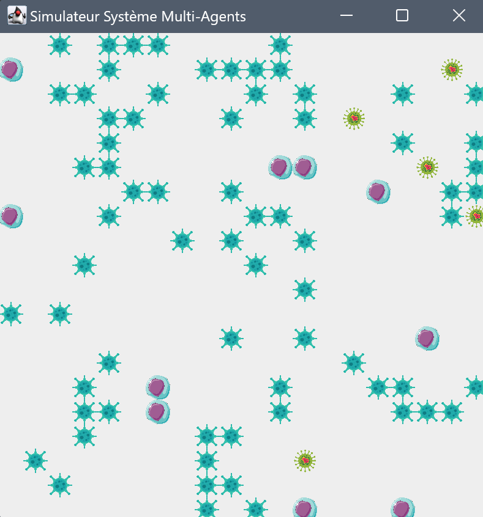
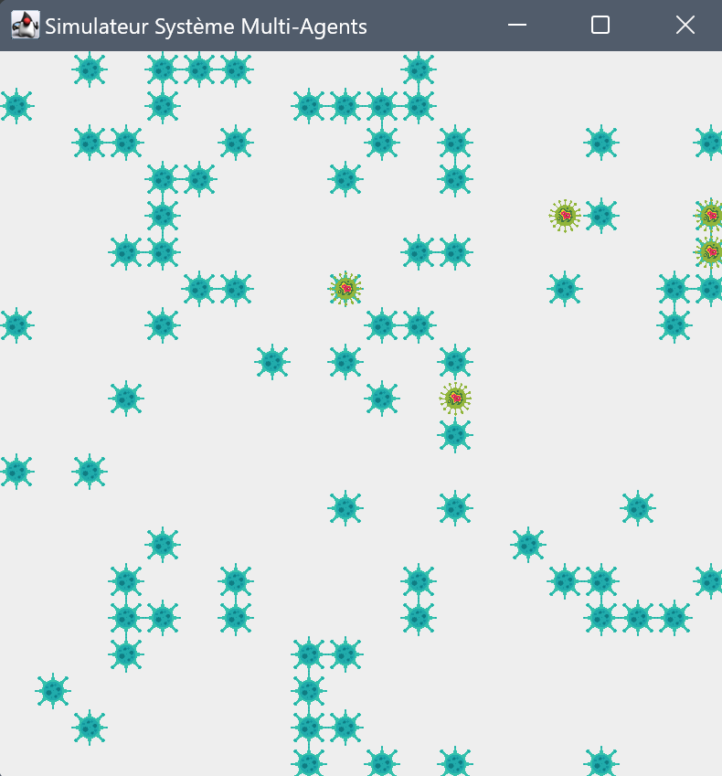

<p align="center">

</p>
<h1 align="center"> Système multi-agents</h1>

---

## 📝 Introduction

Les systèmes multi-agents sont des ensembles d'entités autonomes appelées agents qui interagissent pour atteindre des objectifs communs ou individuels. Chaque agent dispose de capacités de raisonnement et d'action, lui permettant de prendre des décisions autonomes en fonction de son environnement et des informations disponibles.

Ce projet propose de concevoir une bibliothèque de simulation de systèmes multi-agents, illustrée par un exemple concret de propagation de virus. Le but est d'utiliser des design patterns pour assurer la flexibilité et la maintenabilité du code.

## 🚀 Solution Proposée

### Présentation de la Librairie

La bibliothèque proposée pour la simulation de systèmes multi-agents se compose de plusieurs classes clés, réparties dans les packages `Model`, `Controller` et `View`.

- **Model** :
    - `Agent` : Représente un agent général dans le système.
    - `Cell` : Représente une cellule qui peut être infectée.
    - `Virus` : Représente un virus capable d'infecter des cellules.

- **Controller** :
    - `Strategy` : Interface pour les différentes stratégies d'action des agents.
    - `HealthyStrategy` : Stratégie pour les agents non infectés.
    - `InfectedStrategy` : Stratégie pour les agents infectés.
    - `Simulator` : Gère la simulation en appliquant les différentes stratégies aux agents.

- **View** :
    - `SimulatorView` : Affiche l'état actuel de la simulation.

Les différentes classes sont implémentées dans le dossier src, mais on pourrait les séparer en deux catégories :
* la librairie générique avec les classes : `Agent, AgentFactory, Environnement et Strategy`.
* le cas pratique visualisant la propagation de cellules infectées en ajoutant les classes : `Virus, Cellule, InfectedStrategy et HealthyStrategy`.

## 📍 Prérequis pour la compilation
- Java


## 🖼️ Screenshots

| Jeu Temps 1            | Jeu Temps 2            | Jeu Temps 3            |
|------------------------|------------------------|------------------------|
|  |  |  |


## 🏁 Pour commencer
1. Cloner le projet
2. Compilez les fichiers Java avec
```java
javac *.java
```
3. Exécutez le programme avec java Main.
4. Ou sinon sous IntelliJ, vous pouvez exécuter le programme en cliquant sur le bouton "Run" en haut à droite de l'écran.

> [!WARNING]  
> Si jamais les ressources (dossier img) ne sont pas trouvées, c'est peut-être parce que le chemin d'accès est incorrect. Pour corriger cela, vous devrez définir à nouveau le dossier img comme ressource dans votre IDE.

## 🚀 Patterns

- **Singleton** : Utilisé pour la classe Simulator afin de garantir qu'il n'y ait qu'une seule instance de la simulation.
- **Factory** : Utilisé pour créer des instances d'agents dans AgentFactory, ce qui permet d'instancier facilement différents types d'agents sans changer le code du contrôleur.
- **Strategy** : Utilisé pour définir les comportements des cellules en fonction de leur état (HealthyStrategy et InfectedStrategy). On peut ainsi changer dynamiquement le comportement des cellules lorsqu'elles changent d'état.
- **State** : Implémenté implicitement par la stratégie, où l'état de la cellule change et la stratégie appropriée est appliquée.

## 📦 Quelques explications sur les conceptions de certaines classes du projet
- **HealthyStrategy** : Les cellules saines évitent les virus en se déplaçant à une position aléatoire si elles détectent un virus à proximité.
- **InfectedStrategy** : Les cellules infectées propagent l'infection aux cellules saines voisines.
- **AgentFactory** : Permet de créer des instances d'agents en fonction de leur type.
- **Simulator** : Classe principale qui gère la simulation. Elle contient une instance de la grille, des agents et des stratégies. Elle gère également le déroulement de la simulation.

# 🔥 Diagramme de Conception

Le diagramme ci-dessous représente la conception de notre projet, en mettant en évidence les designs patterns implémentés

> [!NOTE] 
> Vous pourrez également retrouver le diagramme de conception (format plantUML) dans le fichier `Diagramme.puml` à la racine du projet.


## 📦 Packaging
Pour créer un exécutable, vous pouvez utiliser les commande suivantes :
1. Créez un fichier manifeste avec le contenu suivant :
```shell
Main-Class: Main
```
2. Compilez les fichiers Java avec la commande suivante :
```shell
javac -d bin *.java
```
3. Créez un fichier jar avec la commande suivante :
```shell
jar cfm ../Executable.jar ../manifest.txt -C bin .
```
4. Exécutez le fichier jar avec la commande suivante :
```shell
java -jar Executable.jar
```

> [!NOTE]
> Vous pourrez trouver un fichier jar déjà compilé dans les releases du projet mais aussi à la racine du projet.
> Vous pouvez créer un fichier jar en suivant les étapes ci-dessus.

## 🔍 Perspectives d'améliorations

1. **Amélioration des stratégies** : Utilisation de stratégies plus complexes pour les agents, comme la mutation des virus.

2. **Design UI** : Améliorer l'interface avec des fonctionnalités telles la gestion des différents types de cellules.

## ✍️ Auteurs

👤 **VALLEIX Benjamin**

* GitHub: [@B3njaminV](https://github.com/B3njaminV)
* LinkedIn: [@Benjamin VALLEIX](https://www.linkedin.com/in/benjamin-valleix-27115719a)

👤 **GIRAUDIER Augustin**

* GitHub: [@GIRAUDIERAugustin](https://github.com/AugustinGiraudier)
* LinkedIn: [@GIRAUDIER Augustin](https://fr.linkedin.com/in/augustin-giraudier)


## 📝 License

Copyright © 2024
