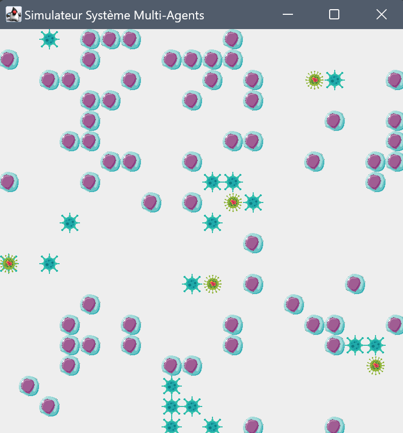

<p align="center">

</p>
<h1 align="center"> Système multi-agents</h1>

---

## 📝 Description

Voici notre projet de système multi-agents réalisé dans le cadre du cours de Software Engineering.

Les différentes classes sont implémentées dans le dossier src, mais on pourrait les séparer en deux catégories :
* la librairie générique avec les classes : `Agent, AgentFactory, Environnement et Strategy`.
* le cas pratique visualisant la propagation de cellules infectées en ajoutant les classes : `Virus, Cellule, InfectedStrategy et HealthyStrategy`.

## 📍 Prérequis pour la compilation
- Java


## 🖼️ Screenshots

| Jeu Temps 1            | Jeu Temps 2            | Jeu Temps 3            |
|------------------------|------------------------|------------------------|
|  |  |  |


## 🏁 Pour commencer
1. Cloner le projet
2. Compilez les fichiers Java avec
```java
javac *.java
```
3. Exécutez le programme avec java Main.
4. Ou sinon sous IntelliJ, vous pouvez exécuter le programme en cliquant sur le bouton "Run" en haut à droite de l'écran.

> [!WARNING]  
> Si jamais les ressources (dossier img) ne sont pas trouvées, c'est peut-être parce que le chemin d'accès est incorrect. Pour corriger cela, vous devrez définir à nouveau le dossier img comme ressource dans votre IDE.

## 🚀 Patterns

- **Singleton** : Utilisé pour la classe Simulator afin de garantir qu'il n'y ait qu'une seule instance de la simulation.
- **Factory** : Utilisé pour créer des instances d'agents dans AgentFactory, ce qui permet d'instancier facilement différents types d'agents sans changer le code du contrôleur.
- **Strategy** : Utilisé pour définir les comportements des cellules en fonction de leur état (HealthyStrategy et InfectedStrategy). On peut ainsi changer dynamiquement le comportement des cellules lorsqu'elles changent d'état.
- **State** : Implémenté implicitement par la stratégie, où l'état de la cellule change et la stratégie appropriée est appliquée.

## 📦 Quelques explications sur les conceptions de certaines classes du projet
- **HealthyStrategy** : Les cellules saines évitent les virus en se déplaçant à une position aléatoire si elles détectent un virus à proximité.
- **InfectedStrategy** : Les cellules infectées propagent l'infection aux cellules saines voisines.
- **AgentFactory** : Permet de créer des instances d'agents en fonction de leur type.
- **Simulator** : Classe principale qui gère la simulation. Elle contient une instance de la grille, des agents et des stratégies. Elle gère également le déroulement de la simulation.

# 🔥 Diagramme de Conception

Le diagramme ci-dessous représente la conception de notre projet, en mettant en évidence les designs patterns implémentés

> [!NOTE] 
> Vous pourrez également retrouver le diagramme de conception (format plantUML) dans le fichier `Diagramme.puml` à la racine du projet.


## 📦 Packaging
Pour créer un exécutable, vous pouvez utiliser les commande suivantes :
1. Créez un fichier manifeste avec le contenu suivant :
```shell
Main-Class: Main
```
2. Compilez les fichiers Java avec la commande suivante :
```shell
javac -d bin *.java
```
3. Créez un fichier jar avec la commande suivante :
```shell
jar cfm ../Executable.jar ../manifest.txt -C bin .
```
4. Exécutez le fichier jar avec la commande suivante :
```shell
java -jar Executable.jar
```

> [!NOTE]
> Vous pourrez trouver un fichier jar déjà compilé dans les releases du projet mais aussi à la racine du projet.
> Vous pouvez créer un fichier jar en suivant les étapes ci-dessus.


## ✍️ Auteurs

👤 **VALLEIX Benjamin**

* GitHub: [@B3njaminV](https://github.com/B3njaminV)
* LinkedIn: [@Benjamin VALLEIX](https://www.linkedin.com/in/benjamin-valleix-27115719a)

👤 **GIRAUDIER Augustin**

* GitHub: [@GIRAUDIERAugustin](https://github.com/AugustinGiraudier)
* LinkedIn: [@GIRAUDIER Augustin](https://fr.linkedin.com/in/augustin-giraudier)


## 📝 License

Copyright © 2024
